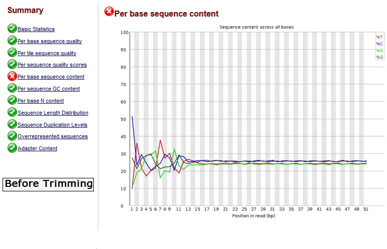
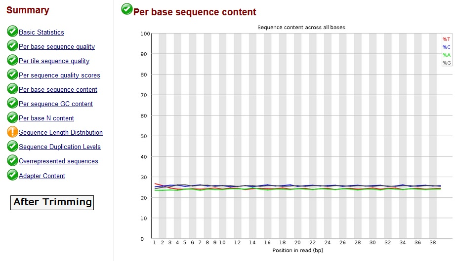

<style>
body {
text-align: justify}
</style>


# Introdução - RNASeq

  Neste trabalho serão analizados os dados transcriptómicos resultantes do *Triple Negative Breast Cancer Stem Cells* e *Differentiated Tumor Cells* com o objectivo de encontrar diferenças entre os genes expressos nos cromossomas de modo a identificar um possível *drug target* . Foram usadas 2 linhas celurares pertencentes a *Mus musculus* e *Homo sapiens*.

  A análise de *count data* resultante do RNA-seq é uma tarefa básica que permite detetar gene expressos diferencialmente. A *count data* é apresentada numa tabela que reporta para cada amostra, o número de fragmentos numa sequência que foram assimilados a cada gene. A partir da análise destes dados é importante quantificar e fazer inferências estatísticas de mudanças sistemáticas entre condições, quando comparado com a variabilidade dentro da condição. 
A package DESeq2 tem métodos capazes de testar expressão diferencial ao usar glms(generalized linear models) binomiais negativos e ainda estimar a dispersão, *fold-change* e as suas respetivas distribuições.
*Para realizar com sucesso esta análise é necessário primeiro:
  +implementar pipeline que a partir dos ficheiros FASTQ permita gerar fastqc reports e análise, ponto 2.1; realizar o Trimmomatic, com intuito de melhorar a qualidade dos dados e por fim realizar o alinhamento e obter a *Burrows-Wheeler Matrix* através do método *Burrows-Wheeler Aligner*(bwa)
  +implementar um RNASeq workflow capaz de gerar dados que permitar fazer inferências estatísticas sobre os dados estudados.
  

# Pré Processamento dos dados - Linux

## Gerar fastQC reports

```{r setup, include=FALSE}
knitr::opts_chunk$set(echo = TRUE)
```


Download dados
```{bash eval=FALSE}
$ /NGSDatasets/reads/breast/IlluminaHiSeq2000/homosapiens/download_dataset.sh
# SRR6638905.fastq.gz  SRR6638906.fastq.gz  SRR6638907.fastq.gz  SRR6638908.fastq.gz
```
  Os reads SRR6638909 e SRR6638910, adicionados posteriormente ao dataset, foram obtidos através do comando ln -s* .
Gerar relatórios fastQC (fastqc $fq) das reads: Estes relatórios vão servir como controlo de qualidade dos dados, para assegurar que a *raw data* parece correcta e não há problemas ou *bias*.

```{bash eval=FALSE}
#Contruir ficheiro sh, bulkfastqc.sh, com script para para gerar relatórios, com o seguinte conteúdo:

#!/bin/bash
for fq in `ls *.fastq.gz`
do
	echo $fq
	fastqc $fq
done

#executar script:
$ chmod +x bulkfastqc.sh
$ ./bulkfastqc.sh
```
 
  Para cada ficheiro, são gerados um fastqc.zip e o respectivo relatório no formato html onde os resultados são apresentados e analisados. Deste processo resulta:
  + 1 Plot “box-and-whisker” permite visualizar os resultados estatísticos agregados em cada posição de todos os reads do ficheiro;
  + Plot do nº total de reads vs a qualidade do score sobre o total do read é também otido como qualidade de scores da sequência;
  + Contagem de GC (em percentagem e vs nº de reads) - formação de uma distribuição normal com pico da média de GC presente no organismo sequenciado (células mamárias; no caso das sequncias de RNA existe uma distribuição maior ou menor ao longo dos transcripts o que provoca a visualização de um plot mais amplo ou mais estreiro do que é o ideal para uma distribuição normal );
  + É possível ainda obter a duplicação dos níveis da sequncia (percentagem de reads da sequencia que estão presentes mais vezes no ficheiro);
  + Conteúdo de adaptadores (plot cumulativo da fracção de reads onde apenas adaptadores específicos da sequencia (tipo de biblioteca correspondente) é procurada.
  + É analisado o conteúdo Kmer onde é medida a contagem de cada pequeno nucleotido de comprimento k. 

  Os nossos resultados cumprem na maioria com o threshold estabelecido para cada passo da avaliação, excepto no *Per base sequence content*, onde pode ser observada uma diferença entre percentagem de ocorrencia de nucleotidos, nas posições iniciais das leituras, isto pode ser devido à presença de dimeros de adaptadores ou presença de rRNA que acrescenta um número de diferentes k-mers na extremidade 5' das leituras. Apesar do *warning/error* no report podemos afirmar que a qualidade dos reads está assegurada após a sua correção com trimming com recurso ao Trimmomatic.



## Trimmomatic

  Trimmomatic (especificamente, trimmomatic-0.39-1) foi usado com objectivo de melhorar a qualidade das nossas leituras e remoção a zona das posições iniciais da sequência.
```{bash eval=FALSE}
#Contruir ficheiro sh, bulktrimm.sh , com script para aplicar trimmomatic a todos os ficheiros, com o seguinte conteúdo:

#!/bin/bash

for fq in `ls *.fastq.gz`
do
	echo $fq
	java -jar /opt/conda/pkgs/trimmomatic-0.39-1/share/trimmomatic-0.39-1/trimmomatic.jar SE $fq TRIMMED_"$fq" ILLUMINACLIP:/NGSDatasets/adapters/IlluminaHiSeq2000/TruSeq3-SE.fa:2:30:10 HEADCROP:12
done

#executado script:
$ chmod +x bulktrimm.sh 
$ ./bulktrimm.sh

#criação de novos ficheiros fastq com prefixo 'TRIMMED_'
```

  Novos relatorios fastqc foram gerados para avaliar a qualidade dos reads pós *trim*. Todas as sequências têm uma avaliação positiva no "Per base sequence content" mas geram avisos no "Sequence Length Distribution", uma explicação para estes avisos é o clip não uniforme dos adaptares nos varios reads, comum em varias bibliotecas de sequencias, como tal a qualidade dos reads está garantida e podem ser utilizados para alinhamentos. Os varios relatorios fastqc para todos os reads estao presentes na pasta */home/group2/fastqcReport/*. 



## Alinhamento(BWA)

  Nesta etapa foram criados 2 links simbólicos para os cromossomas 17 e 13 que foram indexados (bwa index). A escolha destes cromossamas reflete a relevancia dos genes neles presentes e na sua relação com o cancro mamário triplo negativo, nomeadamente BRCA1, BRIP1, RAD51, TP53 no cromossoma 17 e BRCA2 no cromossoma 13. Após o alinhamento de Burrows-Wheeler os reads foram alinhados ao cromossoma com geração de ficheiros .sai. 
  O ficheiro bulkbam.sh foi criado para avaliar os dados de alinhamento gerando ficheiros bam através dos ficheiros .sai.  
```{bash eval=FALSE}
#Comandos para cromossoma 17, mesmos métodos foram aplicado so cromossoma 13
#criar link simbolico do cromossoma
$ ln -s /NGSDatasets/indexes/HomoSapiens/bycromossome/Homo_sapiens.GRCh38.dna.chromosome.17.fa.gz chr17.fa.gz

#indexar cromossoma, dá origem a ficheiros de vários formatos, amb, ann, bwt, etc.
$ bwa index chr17.fa.gz

#alinhar cromossoma indexado a ficheiros TRIMMED, script no ficheiro alignto17.sh com o seguinte conteúdo:

#!/bin/bash
for fq in `ls TRIMMED*.fastq.gz`
do
	echo $fq
	bwa aln chr17.fa.gz $fq > "$fq".sai
done

#executar script:
$ chmod +x alignto17.sh 
$ bash alignto17.sh

#com  os ficheiros .sai do alinhamento entre os cromossomas e dados TRIMMED, podemos criar ficheiros bam para ver avaliar os dados do alinhamento
#É usada a opção samse, pois é a mais indicada para trabalhar com single-ends
#bulkbam para cromossoma 17
for num in {5..8}
do
	fq="SRR663890$num"
	echo ===============
	echo $fq
	echo ===============
	bwa samse chr17.fa.gz "TRIMMED_$fq".fastq.gz.sai "TRIMMED_$fq".fastq.gz | samtools view -S - -b > "$fq".bam
done
```

 Daqui resultam os ficheiros no formato .bam, guardados nas pastas /home/group2/cromossoma17 e /home/group2/cromossoma13 respetivos, utilizados no próximo passo.


## Contagem de read por gene mapeado

### Contagens RPKM
  Para a geração de contagens foi necessário obter o ficheiro de anotação de genoma humano .gtf não presentes no servidor. 
  Estas contagens são usadas para reportar resultados do RNA-seq, RPKM (*Reads Per Kilobase Million*) é utiliado para *single end RNA-seq* onde cada read corresponde a um único fragmento que foi sequenciado.
  Estes valores foram obtidos da seguinte maneira:
```{bash eval=FALSE}
#Usar a função htseq-count que requerem um ficheiro com anotação no formato GFF/GTF para usar com sequência de referência no fomato fasta

#obter o ficheiro gtf:
$ wget -N ftp://ftp.ensembl.org/pub/release-96/gtf/homo_sapiens/Homo_sapiens.GRCh38.96.gtf.gz

#contrui script sh, countreads17.sh, para mapear todos ficheiros .bam -> .readcounts. ex com o seguinte conteúdo:
#!/bin/bash
for fq in `ls *.bam`
do
	echo ======
	echo $fq
	echo ======	
	htseq-count -f bam -s no -i gene_id $fq Homo_sapiens.GRCh38.96.gtf.gz > "$fq".readcounts
done


#com todos os valores de RPKM calculados para todos os genes fazemos uma tabela com todos os genes e valores para todos os reads:
$ echo "geneid SR05 SR06 SR07 SR08 SR09 SR10" > ch17finalreadcount.tab
$ paste *.readcounts | cut -f1,2,4,6,8,10,12 >> ch17finalreadcount.tab

```

  Desta contagens vão resultar as tabelas ch17finalreadcount.tab e ch13finalreadcount.tab que vão ser usadas na análise de expressão diferencial.


# Análise Expressão Diferencial

  Para os seguintes propósito forem necessárias as respetivas packages: 
  - Expressão diferencial: edgeR, limma, DESeq2;
  - Teste do gene set: limma; 
  - Normalização: DESeq2; 
  - Plot: gplots, pheatmap, RColorBrewe. 


```{r include=FALSE}
r = getOption("repos")
r["CRAN"] = "http://cran.us.r-project.org"
options(repos = r)
#install.packages("pheatmap")
#install.packages("gplots")

#Instalar Packages

#if (!requireNamespace("BiocManager", quietly = TRUE))
#    install.packages()

#BiocManager::install("edgeR")
#BiocManager::install("Glimma")
#BiocManager::install("org.Mm.eg.db")
    
#BiocManager::install("Bioconductor/GenomeInfoDbData")
#BiocManager::install("Bioconductor/GenomeInfoDb")
#BiocManager::install('DESeq2')

#BiocManager::install("DESeq2")
#install.packages("pheatmap")
#devtools::install_github("Bioconductor/GenomeInfoDb")
#source("https://bioconductor.org/biocLite.R")
#biocLite("GenomeInfoDbData")
#-------------
```
```{r}
#load de packages necessarios
dependencias <- c(
  'edgeR',
  'limma',
  'Glimma',
  'gplots',
  'DESeq2',
  'pheatmap',
  'RColorBrewer'
)

invisible(
  suppressWarnings(
    suppressMessages(
      lapply(dependencias,library,
             character.only = T,
             warn.conflicts = FALSE,
             quietly = TRUE)
      )
    )
  )
```

## Análise RNASeq a celulas humanas TNBC alinhadas ao cromossoma 17

### Carregar dados e respetivo pré-processamento:

```{r}

#Load de tabela de contagens
sr17 <- read.table("ch17finalreadcount.tab", h = T, row.names = 1)
tail(sr17) # fragmentos do ficheiro que não são necessários para a análise
#remover fragmentos
sr17 <- sr17[1:(nrow(sr17) - 5), ]
head(sr17)
```

```{r}
#filtrar genes que não são expressos
sr17 <- sr17[rowSums(sr17) > 1,]
head(sr17)
dim(sr17) #dimensões após aplicar filtro

condition <- factor(c("bulk", "bulk", "bulk", "spheroid", "spheroid", "spheroid"))
cd <- data.frame(c("bulk", "bulk", "bulk", "spheroid", "spheroid", "spheroid"))
colnames(cd)[1] = "condition"
rownames(cd) = colnames(sr17)
```


### Teste de expressão diferencial
```{r}
dds <- DESeqDataSetFromMatrix(countData = sr17,
                              colData = cd,
                              design = ~ condition)
dds <- DESeq(dds)
res <- results(dds)
res

```

  O data frame resultante contém informação importante para estudo dos dados como a coluna log2FoldChange e os padj(valores de p ajustados), que nos dizem o quanto a expressão do gene varia entre os tratamentos. 


```{r}
mcols(res, use.names = TRUE) #metadados para legenda
resOrdered <- res[order(res$padj),]
summary(res)
sum(res$padj < 0.1, na.rm = TRUE)

```

  Ao ordernar os genes, de acordo com o valor de padj, pode-se observar que os genes com maior relevância são ENSG00000215030, ENSG00000108602, ENSG00000239291, ENSG00000230897, ENSG00000213228, ENSG00000228007. Ao considerar uma fração de falsos positivos de 10%, podemos considerar os genes com valor ajustado de p inferior a 0.1 como significativos(Verificamos que existem 138 genes que cumprem esta condição). 

### Exploração dos resultados

```{r}

#plot MA

DESeq2::plotMA(res, main = "DESeq2", ylim = c(-3, 3))

#plotMA(res, ylim = c(-3, 3), col = ifelse(res$padj>=0.1, "gray32", "red3"), linecol = "#ff000080", xlab = "mean of normalized counts", ylab = expression(log[2]~fold~change), log = "x", cex=0.01)


#Dispersion plot
plotDispEsts(dds)
plotDispEsts(dds, ylim = c(1e-3, 1e1))
#histograma de p-values
hist(res$pvalue, breaks = 20, col = "grey")

#gene mais significante foi o ENSG00000213939
plotCounts(dds, gene = which.min(res$padj), intgroup = "condition")

#Exportar resultados para csv
head(as.data.frame(resOrdered))
write.csv(as.data.frame(resOrdered), file = "ch17treated.csv")

```

  Do **MaPlot** resulta uma comparação de uma experiência com a comparação de 2 grupos. Cada ponto representa um gene, sendo o eixo do x os valores de expressão média dos genes e o eixo y a log2 fold change das 'normalized counts' entre os 2 condições (genes significativos representados por pontos vermelhos). É possível concluir que quanto maiores níveis de expressão, maior a probabilidade de estes serem significativos. 

  O **Dispersion Plot** pontos negros representam a estimação da dispersão para cada gene, sendo que como existem vários resultados para cada gene, estes pontos podem flutuar muito. A linha vermelha mostra a dependência das dispersões em relação à média, que tenta aproximar os valores estimados a esta linha para obter as estimativas finais, representadas pelos pontos azuis, estes vão ser usados no teste de hipósteses. Pontos envoltos por círculo azul, são genes que são classificados como *dispersion outliers* e por isso estes não são aproximados da linha vermelha.

  Da função **plotCounts** retiramos qual o gene como maior significância de entre as condições, cujo resultado foi **ENSG00000215030**.


### Transformação dos dados e visualização

  Os dados transformados devem corresponder à *approximated variance stabilized* e também incluir a correcção dos factores de tamanho/normalização.

  Para testar a qualidade dos dados transformados procedeu-se ao clustering e visualização dos dados. Com isto pretende-se também identificar os genes expressos de maneira diferencial, em particular, amostras cuja condição tenha tido influência no resultados gerados.

```{r}

#VST: varianceStabilizingTransformation
vsd <- varianceStabilizingTransformation(dds, blind = FALSE)

#comparar antes e apos normalizar
head(counts(dds), 3)
head(assay(vsd), 3)

#contruir Heatmap com clustering
select <- rownames(head(resOrdered, 20)) #top 20 apenas
vsd.counts <- assay(vsd)[select,]
df <- as.data.frame(colData(dds)[, c("condition")])

pheatmap(vsd.counts, cluster_rows = FALSE)
pheatmap(vsd.counts)
#heatmap mostra a diferenca clara entre a expressao genetica entre reads de diferentes fatores

```


  No **Heatmap** resultante, os **Dendogramas** mostram o cluster Hierárquico das samples e dos genes. Uma vez que o clustering só é relevante para genes cujos resultados sejam bem suportados, e por isso usamos apenas o top 20 de genes com maior variância entra as condições. Da sua observação, conclui-se que, em relação ao agrupamento dos valores dos genes estes agrupa-se em 2 clusters, que correspondem ás 2 condições, enquanto que quando feito  o clustering das amostras, estas se agrupam de acordo com os valores de expressão .


### Cálculo distância entre amostras 

  Heatmap gerado através da distância entre samples é outro dos usos para os dados tranformados, onde são calculadas as distâncias dos dados da matriz transposta.

```{r}

sampleDists <- dist(t(assay(vsd)))
sampleDistMatrix <- as.matrix(sampleDists)
rownames(sampleDistMatrix) <- dds$condition
colnames(sampleDistMatrix) <- NULL

head(sampleDistMatrix)

colors <- colorRampPalette(rev(brewer.pal(9, "Blues")))(255)
#Heatmap com distancias
pheatmap(
  sampleDistMatrix,
  clustering_distance_rows = sampleDists,
  clustering_distance_cols = sampleDists,
  col = colors
)

```

  **Heatmap da matriz de distância** dá nos uma visão geral das semelhanças e diferenças entre as amostras. Que mais uma vez confirma o agrupamento das samples sob a condição *bulk* e *spheroid*.

### Principal Component Analysis (PCA)
```{r}
plotPCA(vsd, intgroup = c("condition"))

```

   **PCAplot** mostra como os grupos de amostras se agrupam, confirmando as condições atribuídas. É possível agrupar os resultados em 2 grupos. É também possível observar a percentagem de variância do PC1 e PC2, sendo que estem 2 explicam 93% da variância.


## Análise RNASeq a celulas humanas TNBC alinhadas ao cromossoma 13

### Carregar dados e respetivo processamento:

```{r}

#Load de tabela de contagens
sr13 <- read.table("ch13finalreadcount.tab", h = T, row.names = 1)
tail(sr13) # fragmentos do ficheiro que n?o s?o necess?rios para a an?lise
#remover fragmentos
sr13 <- sr13[1:(nrow(sr13) - 5), ]
head(sr13)

#filtrar genes que não são expressos
sr13 <- sr13[rowSums(sr13) > 1,]
head(sr13)
dim(sr13) #dimensões após aplicar filtro

condition <- factor(c("bulk", "bulk", "bulk", "spheroid", "spheroid", "spheroid"))
cd <- data.frame(c("bulk", "bulk", "bulk", "spheroid", "spheroid", "spheroid"))
colnames(cd)[1] = "condition"
rownames(cd) = colnames(sr13)
```


### Teste de expressão diferencial
```{r}
dds <- DESeqDataSetFromMatrix(countData = sr13,
                              colData = cd,
                              design = ~ condition)
dds <- DESeq(dds)
res <- results(dds)
res
```


```{r}
mcols(res, use.names = TRUE) #metadados para legenda
resOrdered <- res[order(res$padj),]
summary(res)
sum(res$padj < 0.1, na.rm = TRUE)

```

  Ao ordernar os genes, de acordo com o atributo padj, pode-se observar que os genes com maior relevância são ENSG00000102804, ENSG00000180172, ENSG00000234031, ENSG00000102531, ENSG00000151846,  ENSG00000136156. Ao considerar uma fração de falsos positivos de 10%, podemos considerar os genes com valor ajustado de p inferior a 0.1 como significativos(Verificamos que existem 56 genes que cumprem esta condição). 

### Exploração dos resultados

```{r}

#plot MA
DESeq2::plotMA(res, main = "DESeq2", ylim = c(-3, 3))

#Dispersion plot
plotDispEsts(dds)
plotDispEsts(dds, ylim = c(1e-3, 1e1))
#histograma de p-values
hist(res$pvalue, breaks = 20, col = "grey")

#gene mais significante foi o ENSG00000232187
plotCounts(dds, gene = which.min(res$padj), intgroup = "condition")

#Exportar resultados para csv
head(as.data.frame(resOrdered))
write.csv(as.data.frame(resOrdered), file = "ch13treated.csv")

```

  Do **MaPlot** resulta uma comparação de uma experiência com a comparação de 2 grupos. Cada ponto representa um gene, sendo o eixo do x os valores de expressão média dos genes e o eixo y a log2 fold change das 'normalized counts' entre os 2 condições (genes significativos representados por pontos vermelhos). É possível concluir que quanto maiores níveis de expressão, maior a probabilidade de estes serem significativos. 

  Da função **plotCounts** retiramos qual o gene como maior significância de entre as condições, cujo resultado foi **ENSG00000102804**.

### Transformação dos dados e visualização

```{r}

#VST: varianceStabilizingTransformation
vsd <- varianceStabilizingTransformation(dds, blind = FALSE)

#comparar antes e apos normalizar
head(counts(dds), 3)
head(assay(vsd), 3)

#contruir Heatmap com clustering
select <- rownames(head(resOrdered, 20)) #top 20 apenas
vsd.counts <- assay(vsd)[select,]
df <- as.data.frame(colData(dds)[, c("condition")])

pheatmap(vsd.counts, cluster_rows = FALSE)
pheatmap(vsd.counts)
#heatmap mostra a diferenca clara entre a expressao genetica entre reads de diferentes fatores

```


  Da observação do **Heatmap** resultante e dos **Dendogramas**, conclui-se que, em relação ao agrupamento dos valores dos genes estes agrupa-se em 2 clusters, que correspondem às 2 condições, enquanto que quando feito o clustering das amostras, estas se agrupam de acordo com os valores de expressão .


### Cálculo distância entre amostras 

```{r}

sampleDists <- dist(t(assay(vsd)))
sampleDistMatrix <- as.matrix(sampleDists)
rownames(sampleDistMatrix) <- dds$condition
colnames(sampleDistMatrix) <- NULL

head(sampleDistMatrix)

colors <- colorRampPalette(rev(brewer.pal(9, "Blues")))(255)
#Heatmap com distancias
pheatmap(
  sampleDistMatrix,
  clustering_distance_rows = sampleDists,
  clustering_distance_cols = sampleDists,
  col = colors
)

```

  **Heatmap da matriz de distância** dá nos uma visão geral das semelhanças e diferenças entre as amostras. Que mais uma vez confirma o agrupamento das samples sob a condição *bulk* e *spheroid*.

### Principal Component Analysis (PCA)
```{r}
plotPCA(vsd, intgroup = c("condition"))

```
  
  **PCAplot** mostra como os grupos de amostras se agrupam, confirmando as condições atribuídas. É possível agrupar os resultados em 2 grupos. É também possível observar a percentagem de variância do PC1 e PC2, sendo que estem 2 explicam 93% da variância.


#Conclusões 


  *Cromossoma 17: É possível concluir após o teste de expressão diferencial dos 138 genes que apresentam adjusted p value inferior a 0.1, 6  são mais significativos com a maior down-regulation: ENSG00000215030, ENSG00000108602, ENSG00000239291, ENSG00000230897, ENSG00000213228, ENSG00000228007.
A observação sob a representação heatmap  permitem ainda concluir qual a variação da expressão do gene pelas diferentes amostras sendo que é possivel observar blocos de genes e como tal acessivel ao utilizador.   
Os dados relativos ao cromossoma não apresentam um elevado grau de dispersão e afirma o agrupamento das samples pelas condições bulk (15% de variação) e spheroid( 66% de variação) com 93%de variância. A exemplo o gene NSG00000102804 que revela expressão mais significativa no grupo sheroid do que bulk. 


  *Cromossoma 13: O grupo de genes com expressão mais significativa apresenta um intervalo semelhante ao obtido no cromossoma 17, sendo que o gene com maior expressão no cromossoma 17 (ENSG00000215030) apresenta padj de 1.825323e-13 e o no cromossoma 13 (ENSG00000102804) padj de 7.829402e-08. 
A análise da distância entre amostras confirma o agrupamento sob a mesma condição spheroid e bulk, sendo que pela principal component analysis existe maior variação na condição spheroid(63%) do que em bulk(13%). 


  Infelizmente a ausência de valores de contagem previos não permite validar os resultados. No entanto, os resultados não indicam qualquer diferença significativa para a expressão dos genes BRCA1(ENSG00000012048) e BRCA2(ENSG00000139618) o que demostra a ineficiência em ambos os meios no tratamento TNBC nesta cultura celular.  

#Referências

- Chavez K., et. al. Triple Negative Breast Cancer Cell Lines: One Toll, in the search for better treatment of triple Negative breast cancer. Breast Dis. Author manuscript. 2010. 32(1-2):35-48;
- McCarthy, Davis J, and Gordon K Smyth. 2009. “Testing significance relative to a fold-change threshold is a TREAT.” Bioinformatics (Oxford, England) 25 (6): 765–71;
-Robinson, M D, D J McCarthy, and G K Smyth. 2010. “edgeR: a Bioconductor package for differential expression analysis of digital gene expression data.” Bioinformatics 26 (1). Oxford Univ Press: 139–40;
-Law, Charity W, Yunshun Chen, Wei Shi, and Gordon K Smyth. 2014. “Voom: precision weights unlock linear model analysis tools for RNA-seq read counts.” Genome Biology 15 (2): R29;
- Love M, Anders S, Wolfgang H. Moderated estimation of fold change and dispersion for RNA-seq data with DESeq2.Genome Biology. 2014, 15:550; 
- Love M, Anders S, Wolfgang H. BioC2014: RNA-Seq workflow fordiferential gene expression. Harvard School of Public Health. 2014; 
- Robinson M, et al. edgeR: a bioconductor package for differential expression analysis digital gene expression data. Bioinformatics, ISCB. 2010, 26(1);
- BootstRatio: A web-based stastitical analysis of fold-change in qPCR and RT-qPCR data using resampling methods.Computers in Biology and Medicine. 2012, 42(4):438-45. 

